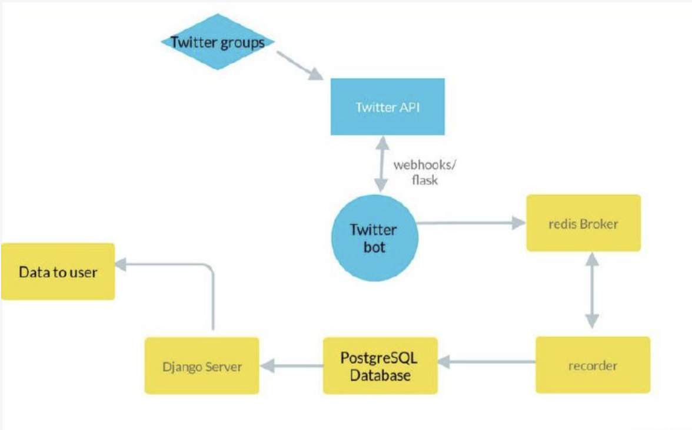

### **General information**
A bot for monitoring community members will connect their Twitter accounts.\
A tool/API needs to be developed that will track the use of certain hashtags and handles associated with the community, retweets from community Twitter accounts, and participation in community Twitter spaces - all of which will be rewarded with "points" on the dashboard.

### **Communities must be tracked by the API**

* how many times someone likes a @project post
* how many times someone retweets a @project post
* how many times they comment on a @project post
* the number of times that @project retweets one of the community member posts
* the number of times that @project likes one of the community member posts
* the number of times that @project comments on the community member posts
* the time spent in twitter spaces of the @project, or number of spaces attended (we haven't found a solution yet)
* turning on notifications (we are still checking our solution)

### **Bot requirements**

* the bot will record the collected data in a data.json file, which will be stored on the server.
* bot will be configured through a web interface or API.
* the process needs to be automated so that the data is collected on the client platform automatically.

### **Used libs** 
* psycopg2-binary
* tweepy
* redis
* django
* celery

### **Project architecture**

**Deploy**

Step 1. Install docker and docker-compose
- `sudo apt update -y`
- `sudo apt upgrade`
- `sudo apt install apt-transport-https ca-certificates curl software-properties-common`
- `curl -fsSL https://download.docker.com/linux/ubuntu/gpg | sudo apt-key add -`
- `sudo add-apt-repository "deb [arch=amd64] https://download.docker.com/linux/ubuntu bionic stable"`
- `sudo apt update`
- `sudo apt install docker-ce`
- `sudo curl -L "https://github.com/docker/compose/releases/download/1.27.4/docker-compose-$(uname -s)-$(uname -m)" -o /usr/local/bin/docker-compose`
- `sudo chmod +x /usr/local/bin/docker-compose`

Step 2. Project deploy

NOTE: Execute commands in the project folder!
- **up project**: `docker-compose up --build -d`
- **down project:** `docker-compose down`
